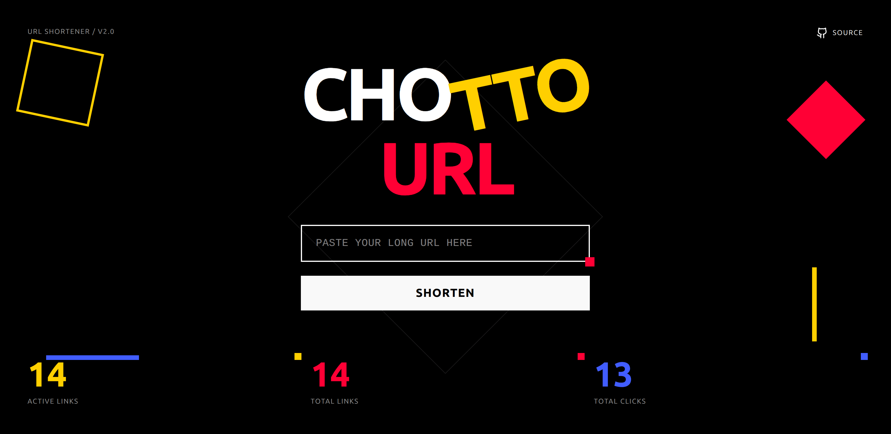
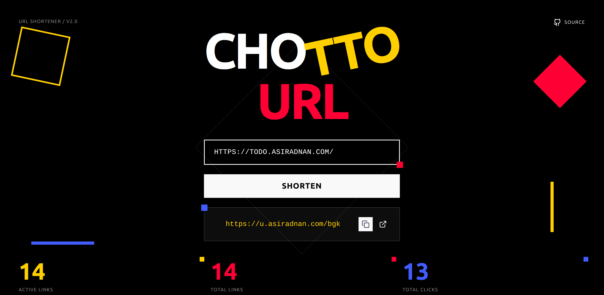

#  ChottoURL

<!--  -->

A URL shortener web application built using React, and TailwindCSS. Paste any long URL and get a short, shareable link instantly, with live click stats tracked in real time.

> This project was built to practice building full-stack applications with a React frontend and a Django REST Framework backend.

## Live Link

Check out ChottoURL in action: [https://chottourl.asiradnan.com](https://chottourl.asiradnan.com)

## Features

- **URL Shortening:** Convert any long URL into a short, shareable link.
- **One-Click Copy:** Copy the shortened URL to your clipboard instantly.
- **Live Statistics:** See active links, total links created, and total clicks in real time.
- **Input Validation:** Detects and flags invalid URL formats before sending to the server.
- **Responsive Design:** Works seamlessly on desktop, tablet, and mobile.

## Backend

The API is powered by Django REST Framework, deployed on a private VPS with Nginx.

Backend repository: [https://github.com/asiradnan/chottourl-backend](https://github.com/asiradnan/chottourl-backend)

## Screenshots

## License

This project is open source under the **MIT License**.